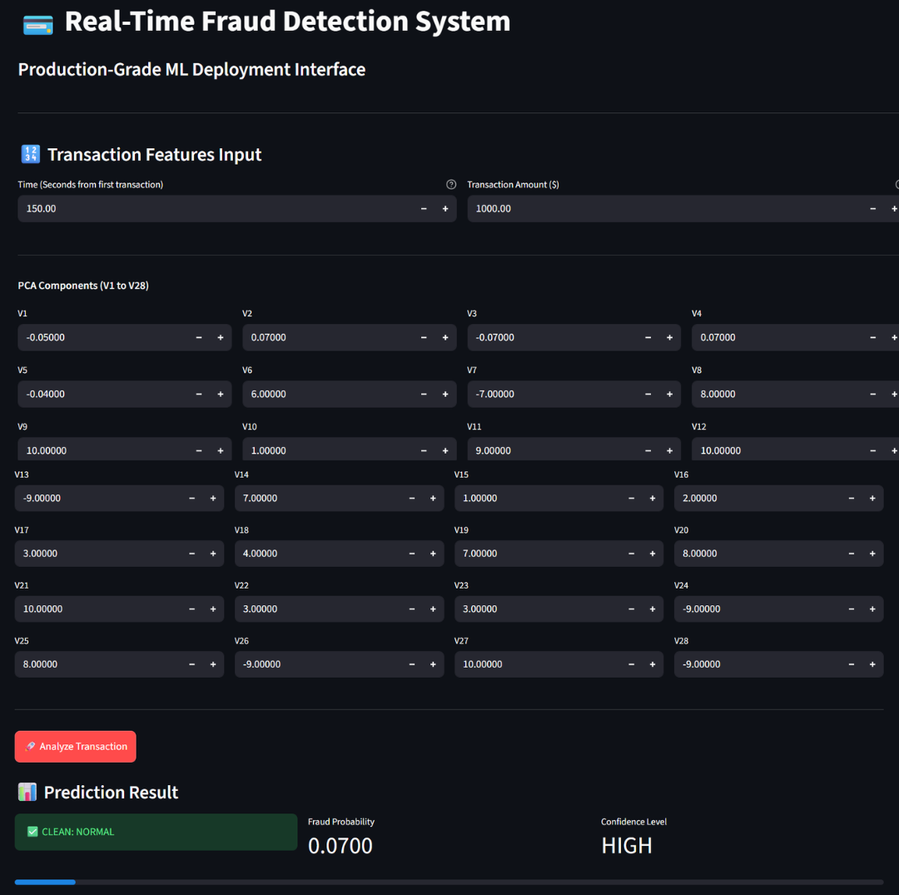
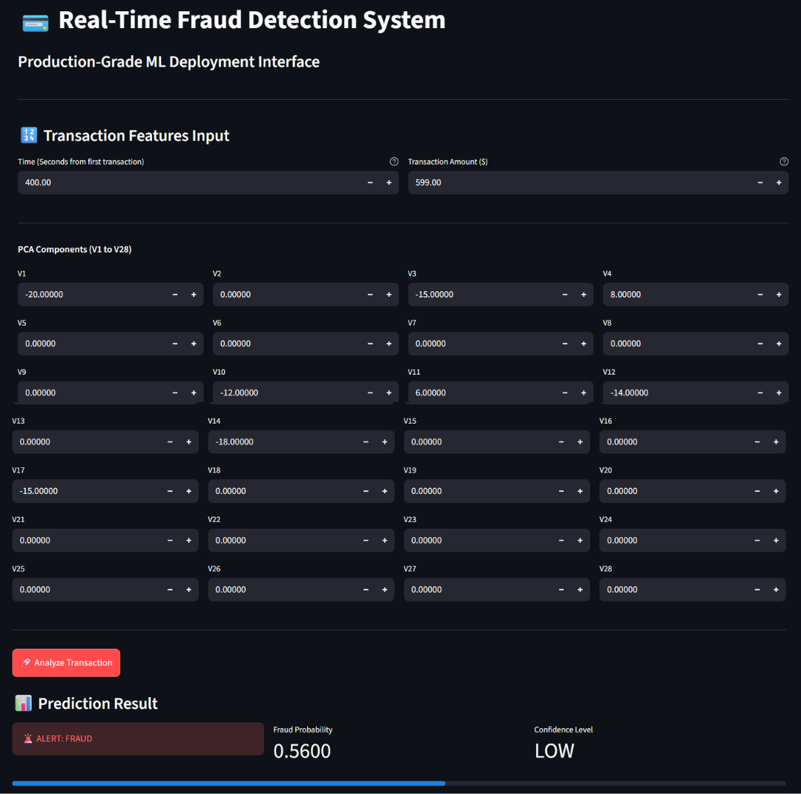
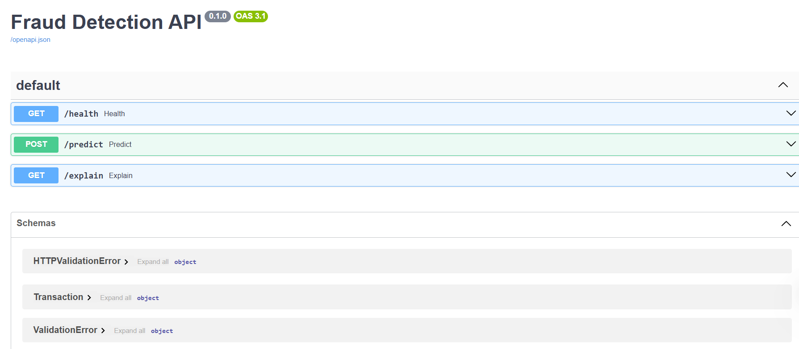
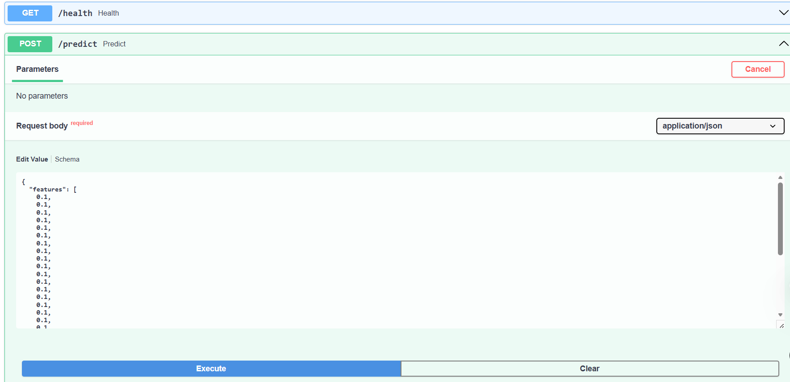
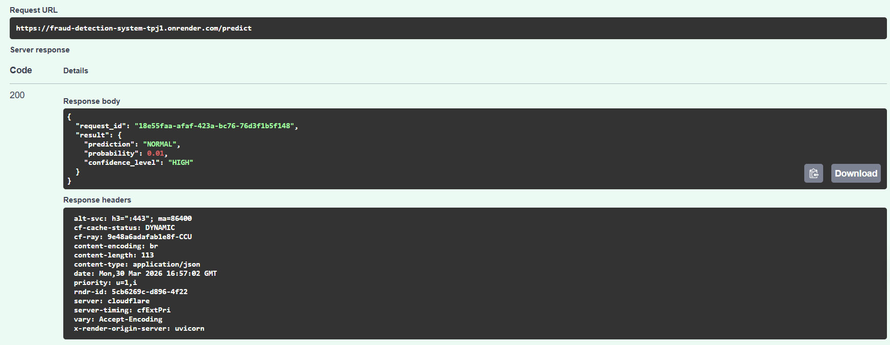
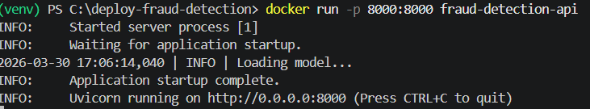

# 💳 Real-Time Fraud Detection System (Production-Grade)

## 🚀 Overview
[](https://fraud-detection-system-tpj1.onrender.com/docs)

This project is a **production-grade machine learning system** designed to detect fraudulent financial transactions in real time.

Unlike typical ML projects, this system is fully deployed with:
- Scalable backend API
- Interactive frontend UI
- Docker containerization
- Cloud deployment

---

## 🧠 Problem Statement

Financial fraud causes billions in losses annually. The goal is to build a system that can:

- Detect fraud in real-time
- Provide probability-based risk scoring
- Be deployed as a production service

---

## 🏗️ System Architecture


User → Streamlit UI → FastAPI Backend → ML Model → Response


### Components:

- **Frontend**: Streamlit (User Interface)
- **Backend**: FastAPI (REST API)
- **Model**: Random Forest Classifier
- **Deployment**: Docker + Cloud
- **Data Flow**:
  - User inputs transaction features
  - API processes request
  - Model predicts fraud probability
  - Response returned instantly

## 🧠 Model Serving Architecture

The trained machine learning model is integrated within the FastAPI backend service.

- The model (`final_model.pkl`) is loaded during API startup
- All predictions are served via the `/predict` endpoint
- The model is not exposed directly; it is accessed through the API layer

This design follows industry best practices for deploying ML models as scalable services.

## 🖥️ Frontend Usage

The Streamlit frontend interacts with the deployed API.
```
API_URL = "https://fraud-detection-system-tpj1.onrender.com/predict"
```
### Run locally:
```bash
streamlit run frontend/streamlit_app.py
```

### 🔹 User Interface (Streamlit Frontend) - Normal Transaction Example
 
### 🔹 Fraud Prediction Example

### 🔹 API Documentation (FastAPI Swagger UI)



### 🔹 Docker Container Running (Backend Service)


---

## 📦 Project Structure

```
fraud-detection-deploy/
├── app/
│   ├── main.py          # FastAPI entry point
│   ├── inference.py     # Model inference logic
│   ├── schema.py        # Input validation
│   ├── logger.py        # Logging system
│   ├── config.py        # Configurations
│   └── utils.py         # Utility functions
├── frontend/
│   └── streamlit_app.py # Streamlit dashboard
├── models/
│   └── final_model.pkl  # Trained model artifact
├── Dockerfile           # Containerization config
├── requirements.txt     # Dependencies
└── README.md            # Project documentation
```

---

## ⚙️ Features

- ✅ Real-time fraud prediction
- ✅ Probability-based scoring
- ✅ Confidence level classification
- ✅ Input validation using Pydantic
- ✅ Structured logging
- ✅ Request tracking with unique IDs
- ✅ Dockerized deployment
- ✅ Cloud-hosted API

---

## 🌐 Live API

🔗 https://fraud-detection-system-tpj1.onrender.com/docs

> ⚠️ Note: On free-tier deployment, the service may take a few seconds to respond after inactivity due to cold start.

---

## 📡 API Usage

### 🔹 Endpoint


POST /predict


### 🔹 Request Body

```
{
  "features": [0.1, -1.2, ..., 0.5]
}
🔹 Response
{
  "request_id": "uuid",
  "result": {
    "prediction": "FRAUD",
    "probability": 0.91,
    "confidence_level": "HIGH"
  }
}
```
# 🐳 Docker Setup
Build Image

```
docker build -t fraud-detection-api .
```
Run Container
```
docker run -p 8000:8000 fraud-detection-api
```

## 💻 Local Setup
1. Clone Repo
git clone https://github.com/<your-username>/fraud-detection-deploy.git
cd fraud-detection-deploy
3. Install Dependencies
pip install -r requirements.txt
4. Run Backend
uvicorn app.main:app --reload
5. Run Frontend
streamlit run frontend/streamlit_app.py

## 📊 Model Details

- **Algorithm:** Random Forest  
- **Dataset:** Credit Card Fraud Detection  
- **Imbalance Handling:** SMOTE + Class Weights  

**Evaluation Metrics:**
- Precision  
- Recall  
- F1 Score  
- ROC-AUC  

---

## 🔍 Advanced Features

- Threshold tuning  
- Confidence scoring system  
- Modular inference pipeline  
- Production-level logging  
- Scalable API design  

---

## 🚀 Future Improvements

- Add SHAP explainability endpoint  
- Deploy frontend on cloud  
- Add authentication & rate limiting  
- Integrate monitoring (Prometheus/Grafana)  
- CI/CD pipeline (GitHub Actions)  

## 👨‍💻 Author

Laeba Jamil
